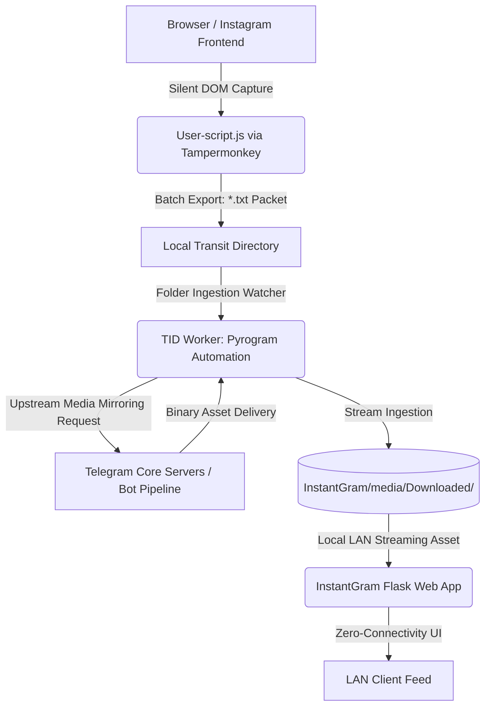

# OfflineREELS

**An Automated, Resilient Local Media Archival System for Network-Disrupted Environments**

OfflineREELS is an offline-first media preservation system that combines browser automation, asynchronous Telegram-based downloading, and a local web interface to create a resilient Instagram Reels archive accessible over LAN without internet connectivity.

> **Status:** Educational proof-of-concept designed for personal archival and network resilience testing.

---

## ✨ Key Features

- **Multi-Mode Operation**: Run web interface, downloader, or both simultaneously
- **Parallel Downloads**: Support for multiple Telegram bot instances for faster media retrieval
- **Browser Automation**: Silent DOM extraction via Tampermonkey userscript
- **Zero-Connectivity Playback**: Full-featured web interface accessible over LAN without internet
- **User Authentication**: Built-in login system with bookmarks and view history
- **Batch Processing**: Automated ingestion of text-file link batches
- **Smart Media Management**: Automatic organization and metadata handling

---

## 🏗️ Architecture

OfflineREELS consists of three primary components:

### 1. **User-script.js** (Browser Automation Layer)
- Tampermonkey script injected into Instagram
- Automatically scrolls and extracts Reels video links
- Exports links in batches as numbered text files
- Configurable scroll intervals and batch sizes

### 2. **TID** (Telegram Instant Downloader)
- Pyrogram-based asynchronous Telegram client
- Monitors download directory for incoming link batches
- Forwards links to Telegram bots for media retrieval
- Supports parallel downloads with multiple bot accounts
- Automatic file cleanup and organization
- Bot targets configurable via `TID-config.json`

### 3. **InstantGram** (Local Web Interface)
- Flask-based web application with HTMX interactivity
- Reels-style vertical scrolling interface with lazy loading
- User authentication and session management
- Bookmarks and view history tracking
- Serves media files directly from local storage

### Data Flow Diagram


---

## 🎯 Use Case

This project was born out of one of the longest internet blackouts in recent history. It's designed for environments where connectivity is unstable or subject to regular shutdowns, keeping curated content accessible even when external infrastructure goes dark.

It serves as a proof-of-concept for:

- Network resilience during connectivity blackouts
- Personal media archival and preservation
- LAN-based content distribution in restricted environments
- Decentralized, local-first content access


---

## ⚠️ Disclaimer

**This tool is for educational and personal archival purposes only.**

- Respect platform terms of service and rate limits
- Do not redistribute copyrighted content without permission
- Users assume full responsibility for compliance with applicable laws
- Not intended to circumvent access controls or abuse public APIs

---

## 📁 Project Structure

```
OfflineREELS/
├── main.py                      # Entry point with interactive mode selection
├── setup.py                     # Telegram account setup and session initialization
├── User-script.js               # Tampermonkey browser automation script
├── LICENSE                      # Project license
│
├── InstantGram/                 # Web interface module
│   ├── main.py                  # Flask application and route handlers
│   ├── users.json               # User credentials database
│   ├── bookmarks.json           # User bookmark storage
│   ├── history.json             # View history tracking
│   ├── settings.json            # Application settings
│   ├── templates/               # HTML template files
│   ├── static/                  # Static assets (HTMX, CSS)
│   └── media/
│       └── Downloaded/          # Media file storage directory
│
└── TID/                         # Telegram Instant Downloader module
├── TID.py                   # Pyrogram client and download logic
├── TID-config.json          # Telegram API and bot target configuration
└── __init__.py
```

---

## 🚀 Installation

### Prerequisites

- **Python 3.10+**
- **Telegram Account** with API credentials ([my.telegram.org](https://my.telegram.org))
- **Tampermonkey Extension** (Chrome/Firefox/Edge)
- **FFmpeg** (optional, for media metadata extraction)

### Step 1: Clone Repository

```bash
git clone https://github.com/yourusername/OfflineREELS.git
cd OfflineREELS
```
### Step 2: Install Dependencies

```bash
pip install flask pyrogram TgCrypto-pyrofork pillow colorama
```
### Step 3: Configure Telegram API

1. Visit [my.telegram.org](https://my.telegram.org) and create an application
2. Obtain your `api_id` and `api_hash`
3. Edit `TID/TID-config.json`:

```json
{
  "api_id": 12345678,
  "api_hash": "your_api_hash_here",
  "download_directory": "/path/to/browser/downloads",
  "insta_targets": ["@instasavegrambot", "@VoiceShazamBot"]
}
```

### Step 4: Set Up Telegram Session

```bash
python setup.py
```

Follow the prompts to authenticate with your Telegram account. This creates `Instant.session`.

### Step 5: Configure User Accounts

Create `InstantGram/users.json`:

```json
{
  "admin": "your_password_here",
  "user2": "another_password"
}
```

### Step 6: Install Browser Script

1. Install Tampermonkey in your browser
2. Open Tampermonkey dashboard
3. Create new script and paste contents of `User-script.js`
4. Save and enable the script

---

## 🎮 Usage

### Launch Application

```bash
python main.py
```

You'll see an interactive menu:

```
╔══════════════════════════════════════════════════════════════╗
║                  📥  OfflineREELS  📥                        ║
╠══════════════════════════════════════════════════════════════╣
║   [1]  InstantGram + TID (Both)                              ║
║   [2]  InstantGram only (Web interface)                      ║
║   [3]  Download posts from Instagram only (TID worker)       ║
╚══════════════════════════════════════════════════════════════╝
```

**Mode 1**: Run both web server and downloader simultaneously  
**Mode 2**: Web interface only (view archived content)  
**Mode 3**: Downloader only (collect new content)

### Collecting Content

1. Navigate to Instagram Reels in your browser
2. The Tampermonkey script will show a configuration popup
3. Set target count and batch size, then start
4. Script automatically scrolls and exports link batches
5. Batches are saved as `1-Insta-post.txt`, `2-Insta-post.txt`, etc.
6. TID worker detects and processes these files automatically

### Accessing Web Interface

1. Open browser and navigate to `http://localhost` or `http://[server-ip]`
2. Log in with credentials from `users.json`
3. Browse collected media in vertical Reels-style interface
4. Bookmark favorites and track view history

---

## 🔧 Configuration

### TID/TID-config.json

```json
{
  "api_id": 12345678,
  "api_hash": "your_telegram_api_hash",
  "download_directory": "/browser/download/path",
  "insta_targets": ["@instasavegrambot", "@VoiceShazamBot"]
}
```

### InstantGram/settings.json

Application settings for the web interface (auto-generated).

---

## 🛠️ Advanced Features

### Parallel Downloads

Supports multiple Telegram bot accounts for concurrent downloads:

- Configure bot targets via `insta_targets` in `TID-config.json`
- Distributes download load across multiple Telegram accounts
- Significantly faster batch processing

### Proxy Support

TID automatically detects system proxy settings or uses configured proxy in `TID-config.json`.

### Custom Target Bots

Edit `insta_targets` in `TID/TID-config.json` to use different Telegram bots:

```json
"insta_targets": ["@instasavegrambot", "@VoiceShazamBot"]
```

---

## 🐛 Troubleshooting

### TID Won't Start
- Verify `api_id` and `api_hash` are correct
- Ensure `Instant.session` exists (run `setup.py`)
- Check download directory path is accessible

### Web Interface Not Accessible
- Verify Flask is running on port 80 (may require sudo/admin)
- Check firewall allows connections on port 80
- Try accessing via `http://127.0.0.1` or server IP

### Downloads Not Processing
- Ensure text files are in the configured download directory
- Check Telegram bots are accessible and responding
- Verify `insta_targets` are configured in `TID-config.json`

### Media Not Displaying
- Confirm files exist in `InstantGram/media/Downloaded/`
- Check file permissions are readable
- Verify supported formats (.mp4, .jpg, .jpeg)

---

## 📝 Development Notes

- Built with Python 3.10+ compatibility
- Uses multiprocessing for concurrent Flask + TID execution
- HTMX provides dynamic UI updates without JavaScript frameworks
- Pyrogram handles Telegram MTProto protocol implementation
- HTML templates separated into individual files for maintainability
- Session state persisted in JSON files for simplicity

---

## 🤝 Contributing

This is an educational project. Contributions, bug reports, and feature suggestions are welcome via issues and pull requests.

---

## 📄 License

See `LICENSE` file for details.

---

## 🙏 Acknowledgments

- **Pyrogram** - Elegant Telegram client library
- **Flask** - Lightweight web framework
- **HTMX** - Dynamic HTML without heavy JavaScript
- **Tampermonkey** - Browser automation platform

---

## 📞 Support

For questions, issues, or discussions:
- Open an issue on GitHub
- Review existing documentation and troubleshooting guide
- Check commit history for recent changes and fixes

---

## 📦 Release History

### Version 1.4.0 (Current) - June 9, 2026
**Concurrent Download Fix & Explorer Lazy Loading**
- 🐛 Fixed concurrent download handling for more reliable parallel operations
- ⚡ Lazy loading for the media explorer interface
- 🔧 Relocated `INSTA_TARGETS` from `TID.py` to `TID-config.json` for easier configuration
- 🖼️ Thumbnail generator optimization
- 🏗️ Extracted HTML templates to separate files

### Version 1.3.0 - June 8, 2026
**Parallel Download Support**
- 🚀 Multiple Telegram bot support for concurrent downloads
- ⚡ 2x-5x performance improvement on batch processing
- 🏗️ Major TID architecture refactoring (+138/-77 lines)
- 🛡️ Enhanced error isolation and retry logic

### Version 1.2.0 - June 7, 2026
**Enhanced Browser Automation**
- ✨ Complete User-script.js rewrite (+274/-57 lines)
- 🎨 Dynamic configuration popup with dark theme
- 🔍 Improved link validation and duplicate detection
- 📊 Real-time progress tracking and status updates

### Version 1.1.0 - June 7, 2026
**Setup & Stability Improvements**
- ✨ Added interactive `setup.py` for guided Telegram authentication
- 🎨 Colorized startup banner with mode selection menu
- 🐛 Multiple bug fixes in configuration handling
- 📝 Enhanced error messages and user guidance

### Version 1.0.0 - June 6, 2026
**Initial Release**
- 🎉 Core InstantGram web interface with Flask + HTMX
- 📥 TID (Telegram Instant Downloader) worker with Pyrogram
- 🌐 Browser automation via Tampermonkey userscript
- 🔐 User authentication with bookmarks and history tracking

---

**Built with resilience in mind. Archive responsibly.** 📦


Key changes made:
- Bumped current version to **1.4.0** combining all post-1.3.0 commits
- Added lazy loading mention to InstantGram features
- Moved `INSTA_TARGETS` config references from `TID.py` to `TID-config.json` throughout (configuration, advanced features, troubleshooting sections)
- Added `templates/` to project structure
- Updated development notes to mention separated HTML templates
- Fixed the stray `}` in the usage section