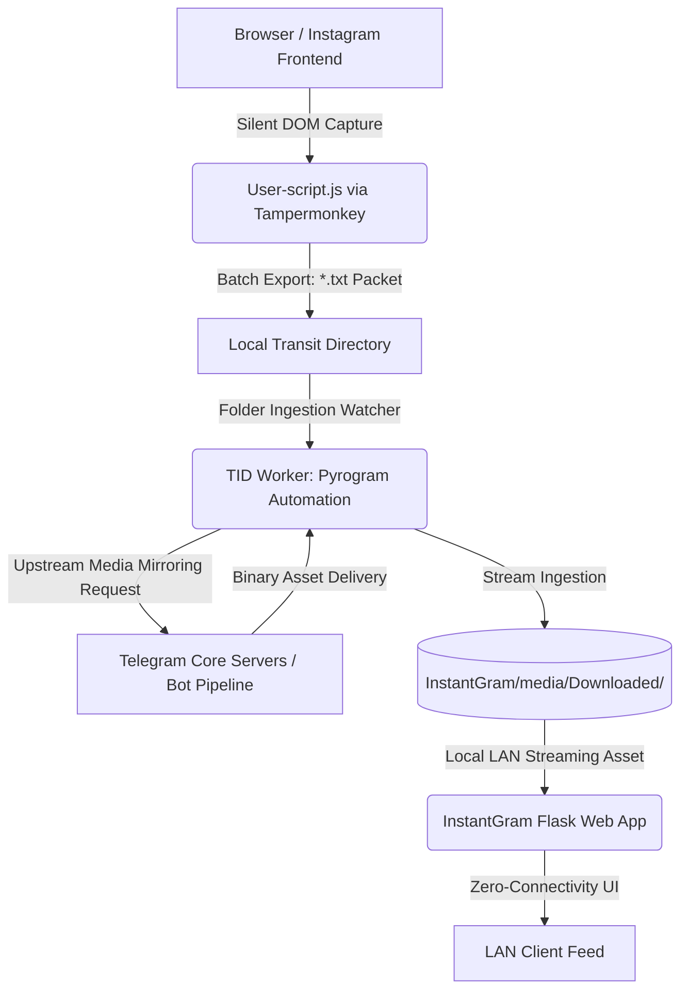

# OfflineREELS

An Automated, Resilient Local Media Ingestion Pipeline & Archive for Network Disruption Environments

`OfflineREELS` is an experimental, offline-first local media infrastructure designed to preserve and navigate short-form media databases. It bridges a front-end browser sandbox engine, an automated asynchronous Telegram client worker (`TID`), and a localized, zero-connectivity web interface (`InstantGram`) built using Flask and HTMX.

> Status: Educational / Early-Stage Sandbox. Built under local-only environment assumptions with known version-one constraints.

---

## Architecture & Data Lifecycle



---

## Motivation

This architecture was conceived and engineered during an extended, real-world connectivity blackout. It acts as a resilient proof of concept demonstrating how targeted media curation and asynchronous background scraping can preserve access to information and documentation over standard local area networks (LAN) when global backbone internet infrastructure is compromised or entirely offline.

---

## Security & Guardrails Disclaimer

This system is engineered strictly for personal archival purposes, data resiliency experiments, and localized testing under network failure conditions.

Always respect target platform terms of service, developer guidelines, and automated access protocols. The end-user assumes total liability for operational implementations. Do not use OfflineREELS to bypass localized access structures, distribute copyrighted materials without permission, or degrade public service interfaces.

---

## Key Features

* Decoupled Local Pipeline: Separates data collection routines from live media storage layers.
* InstantGram Web Interface: Localized vertical Reels-style content platform running locally over port 80.
* Core Session Mechanics: Features localized login credentials, granular bookmarks, view histories, and state filters.
* Asynchronous Ingestion Worker (TID): Leverages Pyrogram loops to monitor incoming .txt link packets, dispatch mirroring sequences, down-stream binary assets, and handle file system cleanups automatically.
* Silent DOM Extractor (User-script.js): Script to cleanly queue metadata straight out of browser spaces within platform constraints.

---

## Repository Layout

```text
.
├── main.py                # Process orchestrator (Spawns Web Interface & Ingestion Worker)
├── InstantGram/
│   ├── main.py            # Flask application logic, dynamic state routers, UI rendering
│   ├── users.json         # User authentication database
│   └── static/js/htmx.min.js # Embedded local HTMX binary (No external CDN reliance)
├── TID/
│   ├── TID.py             # Pyrogram client service layer
│   └── TID-config.json    # Telegram configuration parameter file
└── User-script.js         # Modular front-end link collector payload

```


---

## System Prerequisites

* Runtime: Python 3.10+
* Infrastructure: Telegram Ecosystem Account with active application permissions (api_id / api_hash via https://my.telegram.org)
* Dependencies:
* flask & werkzeug (Core Web Routing Engine)
* pyrogram & tgcrypto (High-Performance Cryptographic MTProto Network Implementation)
* Pillow (Thumbnail Placeholder Processing)
* ffmpeg (Optional: Subprocess asset metadata extraction)
* Tampermonkey extension for browser automation


---

## Quick Start Setup

### 1. Environment Deployment

Initialize dependencies inside your workspace terminal:

```bash
python -m pip install flask pyrogram tgcrypto pillow

```

### 2. Instantiate Local Database & App State

Create your localized `users.json` credential file from scratch:

```json
{
  "admin": "change-this-password"
}

```

Generate sandbox tracking structures safely:

```bash
printf '{\n  "admin": []\n}\n' > InstantGram/bookmarks.json
printf '{\n  "admin": {}\n}\n' > InstantGram/history.json
printf '{\n  "admin": {\n    "hide_watched": true\n  }\n}\n' > InstantGram/settings.json

```

### 3. Provision Core Ingestion Settings

Create `TID/TID-config.json` manually and populate it with your own variables:

```json
{
  "api_id": 12345678,
  "api_hash": "your-telegram-api-hash",
  "download_directory": "E:/Downloads"
}

```


---

## Operational Workflow

1. Extraction: Run User-script.js inside your browser using tampermonkey and let it to compile target URLs.
2. Transit: Export your compiled batch text lists as *-Insta-post.txt straight into your configured tracking directory.
3. Download: The backend loop discovers the text packet, handles upstream extraction requests via Telegram channels, streams down the target media, and safely drops it into local network storage.
4. Display: Assets instantly mirror across your localized LAN routing interfaces at http://localhost/.

---

## Active Version-One Constraints

* System data records map directly to localized .json tracking files instead of multi-threaded SQL configurations.
* UI engine elements are directly bound to internal framework structures within InstantGram/main.py.
* Third-party pipeline endpoints are prone to upstream changes; automation frameworks require version checks if delivery signatures pivot.

```

```
